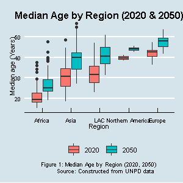

```{r setup, include=FALSE}
knitr::opts_chunk$set(echo = TRUE)
library(tidyverse)
library(ggthemes)
library(forcats)
library(kableExtra)
med_pop <- read.csv("median_pop_median_variant.csv")
```

# **Background**
Several factors will come together to define the future of work in Africa in the next three decades. First, Africa's population is overwhelmingly youthful (see *figure 1*) and projected to rise 2.5 billion by 2050, second only to Asia (*figure 2*). By then, more than one in two Africans will reside in urban areas - some in mega cities of a magnitude the world has never experienced before. Second, componding the grim unemployment figures that prevail, African economies are and will continue to be dominated by the informal sector. The scale of economic informality has implications on the prospect of decent jobs. Third, accross the globe, researchers note a trend in de-industrialization, where the share of GDP from manufacturing relative to the service sector is declining. For Africa, the trend portends *premature de-industrialization* as few countries on the continent ever had notable industrial capacity in the first place. Lastly, and critically, global warming and climate change will constrain Africa's quest to provide for her people. 

All this is in the backdrop of a rise in the digital economy- from blockchain powered Fintech to Internet of Things (IOT) to data driven business models. Digital technology is disrupting workplaces the world over. Manufacturers are already augmenting most unskilled and semi-skilled manual jobs with robots. understandably, this is heightening technology anxiety. However, evidence suggests that technology will likely generate more jobs than it renders obsolete, but with trade-offs. The potential job displacement calls for a paradigm shift in human resource developemnt, and especially the upskilling of exisiting workforce with substantial costs to governments and corporations. Importanty, the digital disruption is unlikely to be a one-off occurrence. Both employers and employees must consantly evaluate their relative positions as newer technologies emerge. Africa can leverage the digital economic opportunities to sustainably provision jobs, feed the balooning population, and manage the inconcievable urban sprawl. 

In this article, I review the future of work in Africa in light of the projected rise of the digital economy. Specifically, my discussion addresses the following questions. 

* With the rise of the digital economy, how will the future job market landscape in Africa be like? 

* What opportunities and constraints does the digital economy place on Africa's quest for economic prosperity? 

* How best can Africa leverage the digital technologies to generate jobs for the youthful population? 

* What set of skills in digital techology and congruent areas would best position the youth in Africa for the future of work?


```{r plot_median-age, echo = FALSE, out.width= "50%"}

```

# **The Prospects of a Digital Economy in Africa**
If Africa has an opportunity in the digital economy, it is chiefly due to the youthful population. We presume that younger people are more receptive to emerging technologies than the elderly. Hence, Africa can tap on the youth potential to cater for rising digital work opportunities in, among other areas, application development, manning digital equipment such as drones, and online clerical jobs. Nowhere is this more evident than in the emerging digital hubs in Africa where work in the human cloud- handling outsourced work from the developed world. 

However, Africa cannot bank on age alone as it may not be sufficient. Training in the ever changing trends in digital technology is paramount to keep the labor force relevant and to equip the upcoming workers with core skills. Again, the purchasing power disparities means that workers in Africa will demand less pay than equivalent workers in the developed world especially when taking minimum wage legislation into account. Proponents of the remote digital economy decry the lack of basic () that come with formal work - sick pay, job protection, ability to negotiate remuneration. Examining digital work from the proponents' perspective raises concerns that it could aggravate the informality that already persists in Africa. In hindsight, the rise of digital economy means an increase in workers exposure, and more so in old age with inadequate or no adequate pension. 

The digital divide has held back the technoligical revolution considerably. It is not that the divide has narrowed. Although most Africans now own or can afford a smart phone, it is not the case for personal computers from which to access most of the digital freelance work. Energy is still a challenge although some countries in the continent have made strides in widely availing electricity. On the flipside, the widespread availability of computing devices has flipped the digital divide on its head. A new entrepreneurial class is mining data from the devices and using it to power a new wave of data driven businesses. Facebook and google are but examples of firms using the model. Businesses in Africa now face a new sort of digital divide- how to use data to drive business decisions. It is not only the hardware that matters but also the skills to utilise the data from the hardware. 

The informality of Africa's businesses means that they are yet to tap on the data-driven model. If a business lacks a point of sale (POS) terminal, for example, it is hard to capture, store amd retrieve data that could prove useful in customer profiling for potential sales promotions and advertisement efforts. If such terminals are inaccesible or unaffordable to small, micro-, and medium enterprises (SMMES), it presents an opportunity not just for hardware, but for the development of applications that tap into such data and point mamagers to business opportunity. To restate this point, the current tools of data analytics may not be suited for small enterprises which presents a void that skilled youth can fill. Importantly, atop the traditional digital knowhow, skills in data analytics could prove useful. 

The digital divide is not on ownership of devices but chiefly on capturing and analyzing the data for business insight. This new divide may concentrate even more power on conglomerates. However, we need to get solutions for SMMEs, and here the yourth can play a key role. 

# **Soiling the Gadgets: Agriculture and the Digital Revolution**
The world's [*next billionaires will arise from agriculture and agribusiness*](https://www.forbes.com/sites/ricardogeromel/2012/12/07/from-what-sector-will-the-next-billionaires-come/#48d495486de9), and a good proportion of them will be from [Africa](https://allafrica.com/stories/201911040034.html). Feeding over 2 Billion people is a lucrative opportunity that the youth should be encouraged and capacitated to take. One of the problems that has plagued Africa's agriculture is that the youth shun it, leaving it instead to the elderly who have neither the energy, the know-how nor the drive to optimise output. Importantly, the sort of intenssive agriculture needed to produce enough to feed the population must neccesarily leverage digital technology- including data analytics discussed before, over and above the traditional manual and mechanical farming methods. 

Agriculture is the dominant economic activity in Africa, employing ()% of the population directly or indirectly. However, primamrilyt due to low productivity, it accounts for ()% of GDP. With about 50% of Africans still residing in rural areas by 2050, agriculture will remain a key source of livelihood. Agriculture in Africa is threatened by global warming and climate change, coupled with the limited capacity to open up more acreage of farmland.  


# **"Viral" Economy: COVID-19 and Digital Work**
A discussion on digitization and the future of work is not complete without looking into the way COVID-19 has and will affect the future of work. While most organizations occasionally toyed with the idea of location independent workers, COVID-19 has forced an implementation of some degree of it. Take learning institutions as an example. Crowded places are ideal for epidemics to take root. COVID-19 means that the prospects of the traditional classroom will be diminished to some degree and more people experiment and come to appreciate online learning. Even in fields like the physical sciences where online classes may not be fully feasible, some degree of digitization could still find its way. See BOB suggestion on Robotics. 

# **Recap: The Future of Work in Africa's Context** 


# **Ideal Youth: Essential Skills Set for the Digital Workplace**


# **Conclusion**


# **References**


